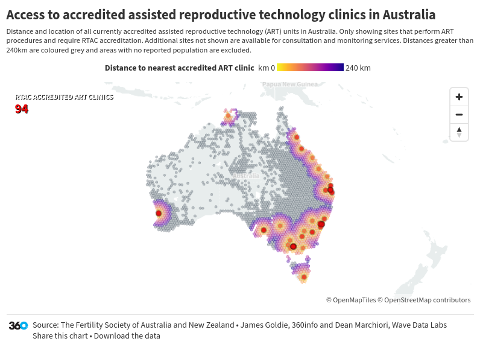
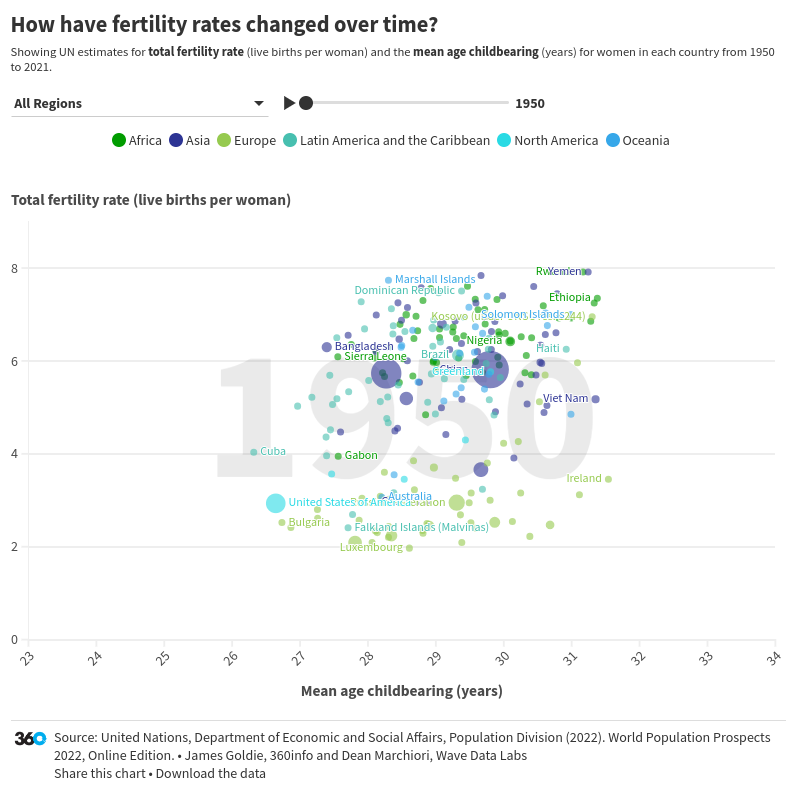

# The fertility industry
### [📊&nbsp;Get&nbsp;the&nbsp;data](data) • [💻&nbsp;Reproduce&nbsp;the&nbsp;analysis](#-reproduce-the-analysis)

An April 2023 WHO report shows that 1 in 6 people worldwide experience infertility issues. Falling birth rates and rising longevity puts pressure on public finance and compels governments to generate policies to reverse demographic decline.
This has been accompanied by an explosion of Assisted Reproductive Technologies (ARTs). Australia’s first public egg and sperm bank opened in July 2023 in Victoria and is the second step in the Victorian Government's $70 million initiative to establish a Public Fertility Service.
What are the industries evolving with the rapid growth of the fertility industry and what legal and ethical problems do they pose? 


[](https://public.flourish.studio/visualisation/15345428/)

[](https://public.flourish.studio/visualisation/15342491/)  


## ♻️ Use + Remix rights

](https://mirrors.creativecommons.org/presskit/buttons/80x15/png/by.png)

These charts, as well as the analyses that underpin them, are available under a Creative Commons Attribution 4.0 licence. This includes commercial reuse and derivates.

<!-- Do any of the data sources fall under a different licence? If so, describe the licence and which parts of the data fall under it here! if most of it does, change the above and replace LICENCE.md too -->

Data in these charts comes from:

* See [data/README.md](data/README.md)

**Please attribute 360info and the data sources when you use and remix these visualisations.**

## 💻 Reproduce the analysis

### Quickstart: use the dev container

This project comes with a ready-to-use [dev container](https://code.visualstudio.com/docs/remote/containers) that includes everything you need to reproduce the analysis (or do a similar one of your own!), including [R](https://r-project.org) and [Quarto](https://quarto.org).

If you have a GitHub account, open the project in GitHub Codespaces for free with two clicks:

[](https://codespaces.new/360-info/report-fertility?quickstart=1)

If you have Docker installed, you can also build and run the container locally:
  - Download or clone the project
  - Open it in [Visual Studio Code](https://code.visualstudio.com)
  - Run the **Remote-Containers: Reopen in Container** command

Once the container has launched (it might take a few minutes to set up the first time), you can run the analysis scripts with:

```sh
quarto render
```

Or look for the `.qmd` files to modify the analysis.

### Manual setup

To setup a development environment manually, 

You'll need to:
- [Download and install Quarto](https://quarto.org/docs/get-started)
- [Download the install R](https://www.r-project.org)
- Satisfy the R package dependencies. In R:
  * Install the [`renv`](https://rstudio.github.io/renv) package with `install.packages("renv")`,
  * Then run `renv::restore()` to install the R package dependencies.
  * (For problems satisfying R package dependencies, refer to [Quarto's documentation on virtual environments](https://quarto.org/docs/projects/virtual-environments.html).)

Now, render the `.qmd` files to the `/out` directory with:

```sh
quarto render
```

## ❓ Help

If you find any problems with our analysis or charts, please feel free to [create an issue](https://github.com/360-info/report-fertility/issues/new)!
